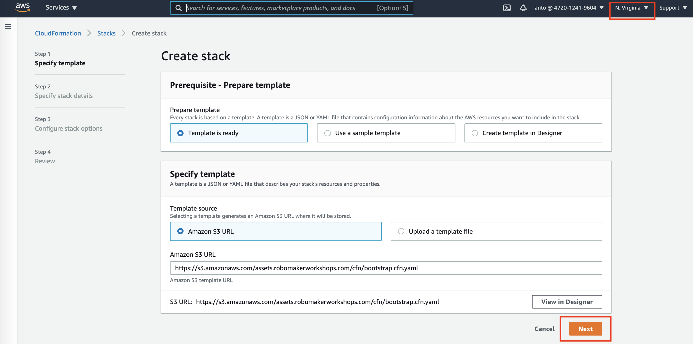
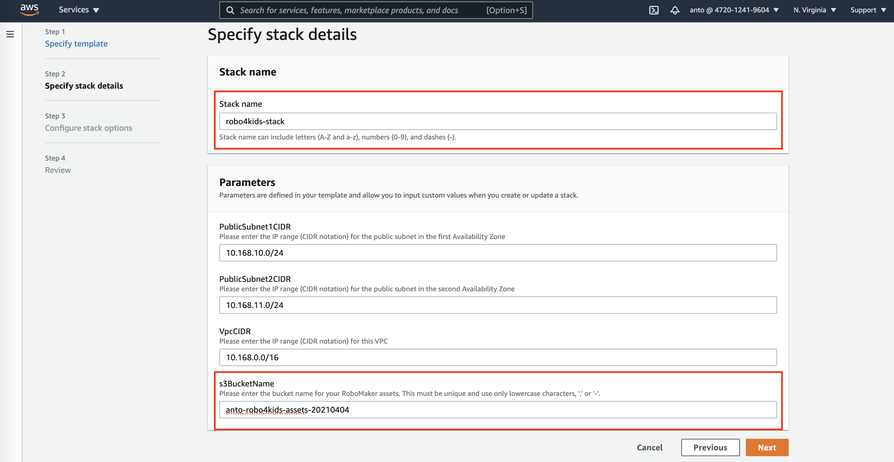
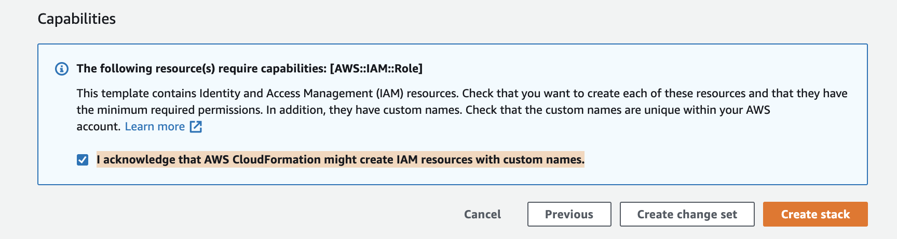
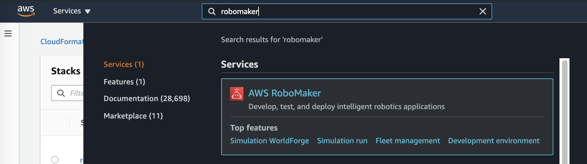
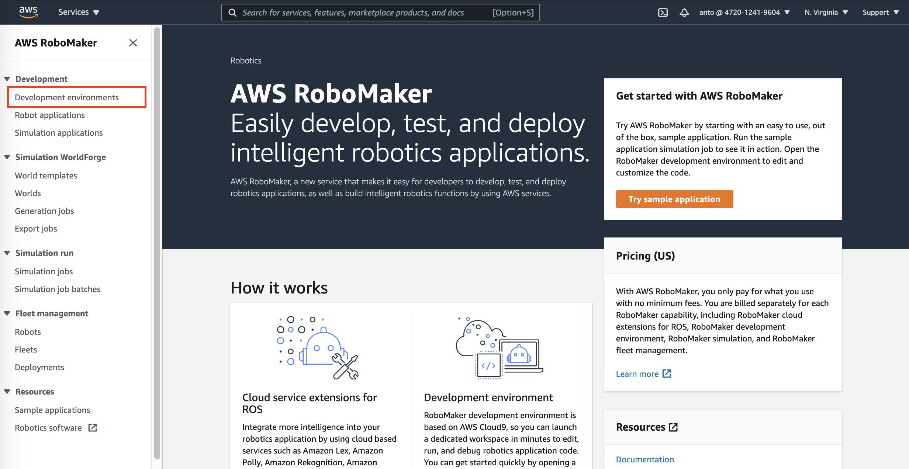
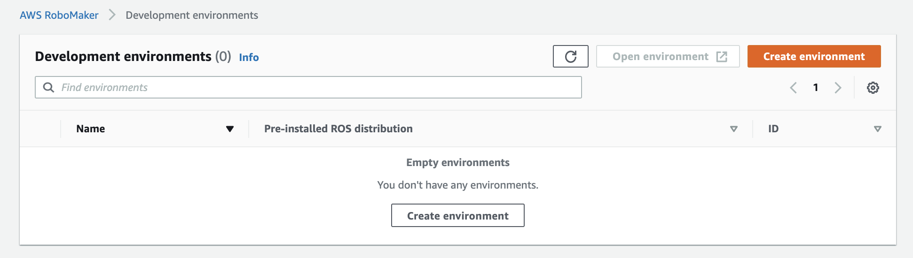
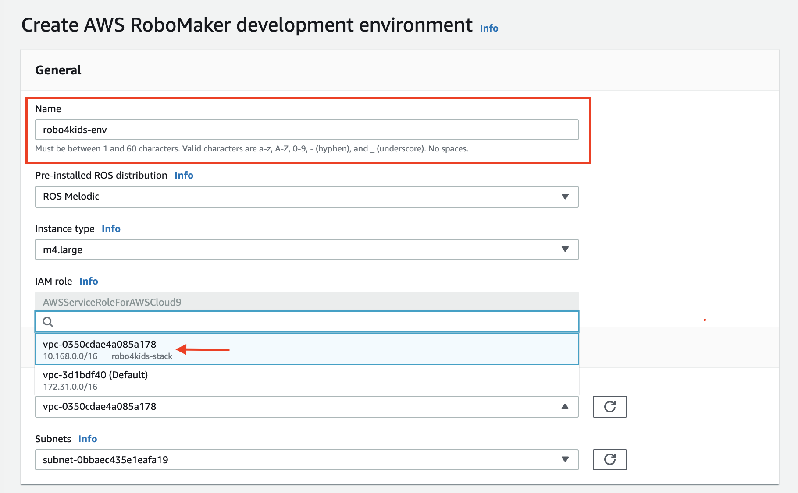

# Robo4Kids

#### This is a project created as a Capstone project for LATAM TECH U Program and is still a work in progress.

Any contribution/suggestion, feel free to contact us ;)
@antonfu
@drodelo
@schauflc

AWS Robo4Kids, is a fully managed service that help students and children program robots without robotics knowledge or experience, helping them build and simulate their own robots and logic interactively, through a graphical interface that provides different scenarios without provisioning or managing any expensive teaching infrastructure.

If you want to know more about how we develop our project and the services involve, please visit this [link](../robomaker-robo4kids/documentation/README.md).

## Instructions for deploying the develop environment

---

### First, some considerations...

- We used as a base [this workshop](https://robomakerworkshops.com/ws/teleop_robomaker) and built our solution on top so the first steps are going to be similar.
- We will deploy resources we are not going to use in our project but are used in the workshop (this is part of the work in progress).
- The instructions below are enough to launch Robo4Kids. It is not necessary to visit the link of the teleop-workshop.

### 1. Setting up the environment

Select the region US East (N. Virginia) us-east-1 and launch the [CloudFormation stack](https://console.aws.amazon.com/cloudformation/home#/stacks/new?templateURL=https://s3.amazonaws.com/assets.robomakerworkshops.com/cfn/bootstrap.cfn.yaml&region=us-east-1):



Continue using the **Next** button and specify a **Stack name** and a **s3BucketName** (remember the bucket name must be unique).



Pass the __Configure stack options__ with the **Next** button. Then review the stack configuration and check the box **I acknowledge that AWS CloudFormation might create IAM resources with custom names.** before going to the button **Create stack**.



This stack will create several resources that we are going to use so keep it at hand.

Next, we will use the search bar at the top of the console to search for Robomaker.



We will go to the menu bar at the left and select **Development environments**.



Next we click **Create environment**.



Some options are needed to launch the environment. We will give a name to the environment (__robo4kids-env__ en el ejemplo), leave the Pre-installed ROS distribution and Instance Type as is and **change the VPC to the one created in our stack**.



Once we click **Create** a AWS Cloud9 environment will be launched. This is because RoboMaker is built on top AWS Cloud9 and have some new features specific for robotics development. To get more details visit [this link](https://docs.aws.amazon.com/robomaker/latest/dg/how-it-works-create-environment.html). This different features are pointed and explained in the [original workshop](https://robomakerworkshops.com/ws/teleop_robomaker).

#### Clone the Robot Application and Install Dependencies

Now that we got our environment running let's set up the robot application.

First we need to clone the repository with Robo4Kids files for RoboMaker in order to be able to launch the simulations.

```console
cd ~/environment 
git clone --branch dev-instr https://github.com/anto-aws/robo4kids.git
```

Once we got the files, we need to set up the file `roboMakerSettings.json` using a bash script named `install_deps.sh`, provided in the assets file.

Notice that the third line require **your cloudFormation stack name** `sudo ./install_deps.sh <your cloudFormation stack>`. In my example, the name is **robo4kids-stack** but if you used another name, you need to change it.

```console
cd robo4kids/robo4kids-robomaker/jetbot/assets/scripts/
chmod +x install_deps.sh
sudo ./install_deps.sh robo4kids-stack
```
